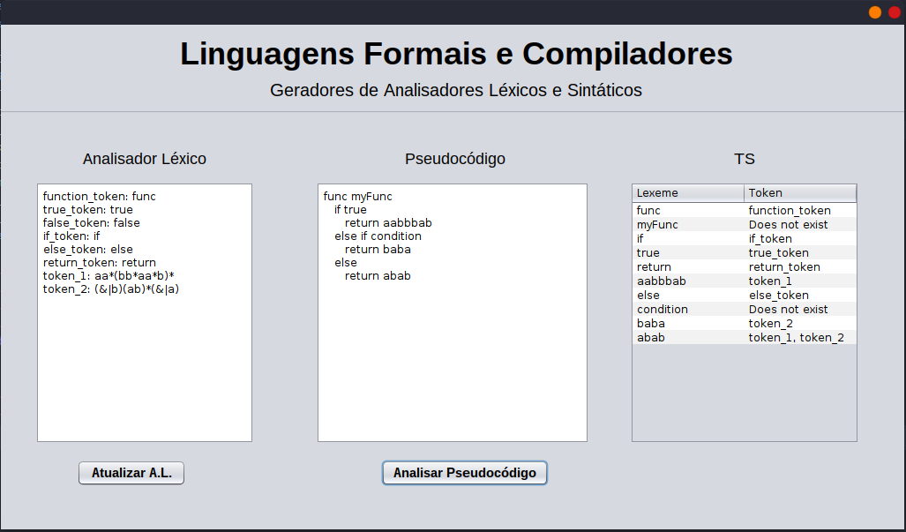

# Geradores de Analisadores Léxicos e Sintáticos
Trabalho da disciplina de Linguagens Formais e Compiladores desenvolvido pelos alunos Alan Djon Lüdke, Eduardo Dias Gutterres e Ricardo Giuliani.
## Como executar
Clone este repositório em sua máquina  e abria o diretório ``out/artifacts/trabalho_jar``. Uma vez dentro do diretório:   
<b>Windows:</b>  
Abrir o arquivo ``trabalho.jar`` com dois cliques.    
<b>Linux:</b>  
Executar o comando: ``java -jar trabalho.jar`` no terminal a partir do diretório do arquivo.

## Como utilizar a aplicação

Primeiramente, é necessário que o usuário defina na parte de 'Analisador Léxico' quais serão os tokens e a expressão regular que corresponde a estes tokens.
Para isso, cada linha da caixa de texto deve conter o nome do token, seguido do caracter de dois pontos ``:`` e em seguida a expressão regular correspondente.
Caso este padrão não seja respeitado, o AL não será atualizado. Por fim, clique no botão 'Atualizar AL'.
  
Agora, basta incluir na parte de 'Pseudocódigo' algum texto que você queira que seja analisado pelo AL. A tabela de símbolos deve então mostrar todos os tokens e lexemas reconhecidos, sem repetição.

## Exemplo

